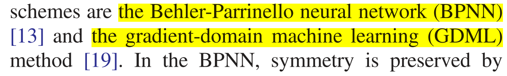
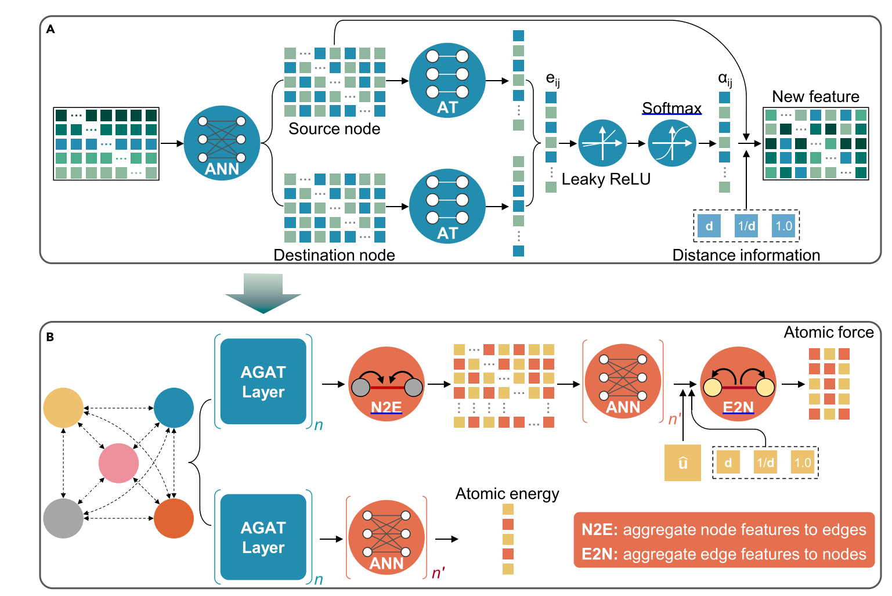
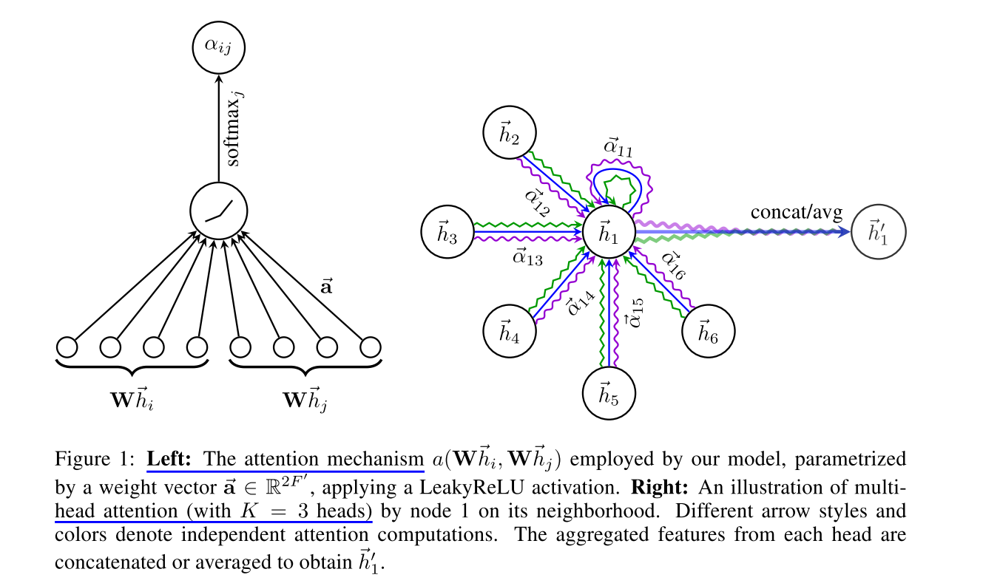

# Paper-List

> The continuous emergence of papers, in fact, is the academic upgrade of the installation package. You keep reading papers to keep up with the academic community. However, it only makes sense to install this upgrade package once you are in sync with the basics on which this paper relies.
>
> Literature review summary focus : what is studied, where is the innovation point, what is the research method, what is the conclusion.
>
> Research entry point : which methodologies have been employed to address the fundamental issue, what are the strengths and limitations of the approach, and how can it be enhanced.

------


## Section1: Osmotic energy generation

### 1.1 aramid nanofiber (ANF) semiconductor-based membranes

### *1.1.1. Light-enhanced osmotic energy generation with an aramid nanofiber membrane*

==CONTENT :== Here, we utilized **aramid nanofiber (ANF) semiconductor-based membranes** to enable light-driven proton transport for osmotic energy generation. Under unilateral illumination, the light-driven proton transport system converted light energy into electrical energy and showed wavelength- and intensity-dependent transmembrane potentials and currents. 


### *1.1.2. A synergistic interfacial and topological strategy for reinforcing aramid nanofiber films*

==CONTENT :== Herein, we present **a synergistic enhancement strategy** by regulating the interfacial interaction and topological structure to prepare a super-strong and super-tough film. Strong interfacial interaction was achieved by Bronsted neutralization reaction between graphene oxide (GO) and aramid nanofibers (ANFs), and the topological structure was regulated using polyvinyl alcohol micelles to greatly reduce structural defects, thus synergistically improving stress transfer among nanomaterials.

The film composed of ANFs(aramid nanofibers), GO(graphene oxide), and PVA(polyvinyl alcohol) was fabricated through a sol–gel–film process, and is abbreviated as AGP film.


### *1.1.3. Transition metal hydroxides@conducting MOFs on carbon nanotube yarns for ultra-stable quasi-solid-state supercapacitors with a ship-in-a-bottle architecture*

==CONTENT :== Herein, we report **a ship-in-a-bottle architecture on carbon nanotube yarn (CNTY) based SCs**, in which transition metal hydroxide (TMH) nanoparticles (Ni(OH)2 or Co(OH)2) are confined in conducting nanoporous metal–organic frameworks (MOFs, Ni3(HITP)2) which anchor onto CNTY, involves the synergy of nanoconfinement and hydrogen bonding network to mutually support each phase toward improved electrochemical performance.

- Yarn-shaped supercapacitors (SCs) functionalized with pseudocapacitive materials，especially long-term cycling stability, owing to the volumetric change during charging/discharging.


-----

## Section2: Deep Potential

> [Development of Deep Potential (DP) series of methods on zhihu](https://zhuanlan.zhihu.com/p/348284750)

**The core of the DP methods** is the Deep Potential model for representing the potential energy surfaces of atomic/molecular systems and the DP Generator (DP-GEN) strategy  for generating optimal data sets and reliable DP models. Recently, the extreme combination of DP methods and high-performance computing allowed us to simulate systems of hundreds of millions of atoms with first-principles precision for the first time. **There are three main problems to be solved:** faster and more accurate calculation of electronic structure; Faster and more accurate molecular dynamics simulation; Faster configuration sampling and more accurate free energy calculation.

### 2.1 *DeePMD-kit: A deep learning package for many-body potential energy representation and molecular dynamics*

> [https://github.com/deepmodeling/deepmd-kit](https://github.com/deepmodeling/deepmd-kit)
>
> [DeePMD-kit’s documentation](https://docs.deepmodeling.com/projects/deepmd/en/master/)

一个完整的模拟过程包括以下步骤：

（1）对于给定的系统，DeePMD-kit先将从头算分子动力学（AIMD）计算得到的**数据转化**（dpdata）为一种自定义的文件格式，其中包括原子的坐标以及原子的能量、力和 virial。

（2） 随后输入到由TensorFLow框架**搭建的势函数网络进行训练**，通过原子坐标预测此时的能量。

（3）训练好的模型将被冻结保存，提供给融合了DeePMD-kit的**传统分子动力学模拟软件**，例如LAMMPS。

（4）**使用LAMMPS对给定的数据进行分子动力学模拟**。需要指出的是，对于同一种系统，不需要重新训练势函数模型，可以复用模型，这正是结合机器学习的优势所在。 


### 2.2 *DP-GEN: A concurrent learning platform for the generation of reliable deep learning based potential energy models*

> DP-GEN: A concurrent learning platform for the generation of reliable deep learning based potential energy models
>
> Journal : nature machine intelligence	Published:  14 September 2023
>
> Lead Author : Bowen Deng (Department of Materials Science and Engineering, University of California Berkeley)
>
> Key words : machine-learning interatomic potential	magnetic moments	
>
> Artical address : [CHGNet as a pretrained universal neural network potential for charge-informed atomistic modelling](https://www.nature.com/articles/s42256-023-00716-3)
>
> Code address:  [DPGEN’s documentation — DP-GEN documentation (deepmodeling.com)](https://docs.deepmodeling.com/projects/dpgen/en/latest/index.html)
>
> [Deepmd-kit & DPGEN 使用笔记 - 知乎 (zhihu.com)](https://zhuanlan.zhihu.com/p/362073474)

**利用模型偏差扩充采样的方式很巧妙**，我想谈谈自己在使用时的一些看法和体会。在第一步训练集的准备上，我其实折腾了不少时间。我得出一个结论：Rubbish in，Rubbish out。纵使工具再强，作为使用者也需要对自己的研究问题首先有明确的认识。我相信尝试了深度势能的不仅有深谙模拟之道的老师们，肯定也有像我一样刚接触模拟没多久的小伙伴们。我们顶头有老师天天催着的压力，**但是研究问题一定首先得夯实基础**。没跑过分子模拟、没接触过第一性原理，上手就拿数据跑，是不可取的。惭愧的说，我不知道废了多少次数据，因为每每发现数据不合理。比如：初始构型与理论构型偏差大，没有考虑色散能修正，采样间隔不合理，采样方案不合适等等。当然，这个过程中得益开源社区开发者和使用者的各位老师同学的帮助，每每替我解惑，让我得以一步步发现和解决问题。**网上有不少的资源，学会合理利用**，在有一定知识储备的情况下与社区的大家交流讨论，在错误中不断成长，才是正确之道。也衷心希望我们使用者和开发者能共同将这个开源社区做大做好。

**DP-GEN的流程基本是全自动化的**，training、exploration、labeling，省去了不少麻烦。但自己的尝试的过程中也产生了不少的疑惑。比如，采用粗糙势函数探索构型空间得到的构型是否真的能很好改善势能面的覆盖程度？如何保证训练、探索和标记在计算成本上的最优化？不同参数设置对训练的影响？不合理的局部构型对整体势函数的影响？更好的采样方法？我发现全自动的过程中，**很多细节被忽略了**，需要我们做更加系统的测试，逐渐形成一套指导方案，从而实现学习的最优化。而自动化的过程中也应加入更多的经验性的思考去指导，比如最重要的采样方案的考虑。当然我也曾想过训练时的初始参数能否继承等问题。以上的问题仅代表自己的胡思乱想，不一定有价值。但我觉得正如之前林峰老师说的，开发软件最重要的是使用的过程，是完善的过程。而这个过程需要整个社区的人一起去经历，做好问题的沉淀、探讨和归纳，让这样一个平台更加robust。


### *2.1. and 2.2. DeePMD-Kit Code*

DeePMD-kit : A deep learning package for many-body potential energy representation and molecular dynamics. DeePMD-kit takes a **system** as the data structure. A snapshot of a system is called a **frame**. A system may contain multiple frames with the same atom types and numbers, i.e. the same formula (like `H2O`). 


One can use a convenient tool [`dpdata`](https://github.com/deepmodeling/dpdata) to convert data directly from the output of first principle packages to the DeePMD-kit format.

```python
dp train input.json
```


### 2.3 BPNN and DPNN

>  The Behler-Parrinello neural network (BPNN) and the deep tensor neural network (DTNN).

BPNN uses the so-called symmetry functions as input and a standard neural network as the fitting function; DTNN, on the other hand, uses as input a vector of nuclear charges and an inter-atomic distance matrix, and introduces a sequence of interaction passes where “the atom representations influence each other in a pair-wise fashion”.


### 2.4 *CHGNet as a pretrained universal neural network potential for charge-informed atomistic modelling*

> CHGNet as a pretrained universal neural network potential for charge-informed atomistic modelling
>
> Journal : nature machine intelligence	Published : 14 September 2023
>
> Lead Author : Bowen Deng (Department of Materials Science and Engineering, University of California Berkeley)
>
> Key words : machine-learning interatomic potential	magnetic moments	
>
> Artical address : [CHGNet as a pretrained universal neural network potential for charge-informed atomistic modelling](https://www.nature.com/articles/s42256-023-00716-3)
>
> Code address : [CHGNet (lbl.gov)](https://chgnet.lbl.gov/)
>
> [https://github.com/CederGroupHub/chgnet](https://github.com/CederGroupHub/chgnet)
>
> [Ceder课题组最新工作：利用图神经网络构造通用势能函数加速能源材料模拟研发 (qq.com)](https://mp.weixin.qq.com/s/wlLpdPjyVbtsfa3ElXkh4w)

==Content :== Large-scale simulations with complex electron interactions remain one of the greatest challenges for atomistic modelling. Although **classical force fields** often fail to describe the coupling between electronic states and ionic rearrangements, the more accurate **ab initio molecular dynamics** suffers from computational complexity that prevents long-time and large-scale simulations, which are essential to study technologically relevant phenomena. 

Here we present **the Crystal Hamiltonian Graph Neural Network** (CHGNet), a graph neural network-based machine-learning interatomic potential (MLIP) that models the universal potential energy surface. 

The Materials Project Database contains a vast collection of DFT calculations on ~146,000 inorganic materials composed of 89 elements. A comprehensive Materials Project Trajectory (MPtrj) Dataset with 1,580,395 atom configurations, 1,580,395 energies, 7,944,833 magmoms, 49,295,660 forces and 14,223,555 stresses.

==Innovation==

- The explicit inclusion of magnetic moments enables CHGNet to learn and accurately represent the orbital occupancy of electrons, enhancing its capability to describe both atomic and electronic degrees of freedom.


**Ceder课题组最新提出了一种基于图神经网络机器学习原子势能（MLIP）的预训练通用原子力场：晶体哈密顿图神经网络（CHGNet）。**CHGNet预训练于Materials Project材料数据库中积累超过十年的第一性原理计算， 超过150万种无机晶体结构的密度泛函理论轨迹数据集。CHGNet使用磁矩信息正则化原子上的电荷自由度，从而能够学习并准确地表示电子的轨道占据，并且增强图神经网络对原子和电子自由度的描述。


>为什么 magnetic moments
>
>

>磁矩是描述物体磁性强弱和方向的物理量。它是一个矢量，用来表示物体在磁场中的响应能力。磁矩可以是原子、分子、电子、离子或宏观物体的属性。 
>
>在原子和分子中，电子的自旋和轨道运动都会产生磁矩。电子的自旋磁矩与电子的自旋有关，而电子的轨道磁矩与电子的轨道运动有关。 电子的轨道占据是指电子在原子或分子中所占据的轨道。轨道占据可以用来描述电子在原子或分子中的分布。

> 对称性约束和长程相互作用（invariant/equivariant symmetry constraints and long-range interaction）
>
> - 平移对称性：原子结构在平移方向上是平移对称的。这意味着，如果我们将原子结构沿着平移方向移动一个距离，那么原子结构的性质不会改变。  
> - 旋转对称性：原子结构在旋转方向上是旋转对称的。这意味着，如果我们将原子结构沿着旋转轴旋转一个角度，那么原子结构的性质不会改变。  
> - 镜像对称性：原子结构在镜像方向上是镜像对称的。这意味着，如果我们将原子结构沿着镜像面镜像，那么原子结构的性质不会改变。  
> - 长程相互作用：原子结构中远距离的相互作用可以通过库仑相互作用、范德华相互作用和氢键相互作用来描述。 
>
> 对称性约束可以帮助我们理解原子结构的性质，而长程相互作用可以帮助我们理解原子结构的稳定性。


### *2.4 DMFF: An Open-Source Automatic Differentiable Platform for Molecular Force Field Development and Molecular Dynamics Simulation*

> Title : *An Open-Source Automatic Differentiable Platform for Molecular Force Field Development and Molecular Dynamics Simulation*
>
> Journal:  American Chemical Society	Impact Factor: 	Published: December 20, 2023
>
> Lead Author:  Xinyan Wang( Tsinghua-Berkeley Shenzhen Institute )
>
> Key words:  force fields
>
> Artical adress:  [DMFF: An Open-Source Automatic Differentiable Platform for Molecular Force Field Development and Molecular Dynamics Simulation | Journal of Chemical Theory and Computation (acs.org)](https://pubs.acs.org/doi/10.1021/acs.jctc.2c01297)


### *2.5. PhyNEO: A Neural-Network-Enhanced Physics-Driven Force Field Development Workflow for Bulk Organic Molecule and Polymer Simulations*

> Title : *PhyNEO: A Neural-Network-Enhanced Physics-Driven Force Field Development Workflow for Bulk Organic Molecule and Polymer Simulations*
>
> Journal:  American Chemical Society	Impact Factor: 	Published: December 20, 2023
>
> Lead Author：Junmin Chen
>
> Key words:  force fields
>
> Artical adress:  [PhyNEO: A Neural-Network-Enhanced Physics-Driven Force Field Development Workflow for Bulk Organic Molecule and Polymer Simulations | Journal of Chemical Theory and Computation (acs.org)](https://pubs.acs.org/doi/10.1021/acs.jctc.3c01045?ref=pdf)

An accurate, generalizable, and transferable force field plays a crucial role in the molecular dynamics simulations of organic polymers and biomolecules. Conventional empirical force fields often fail to capture precise intermolecular interactions due to their negligence of important physics, such as polarization, charge penetration, many-body dispersion, etc. Moreover, the parameterization of these force fields relies heavily on top-down fittings, limiting their transferability to new systems where the experimental data are often unavailable. To address these challenges, we introduce a general and fully ab initio force field construction strategy, named ==PhyNEO==. 


--------------

## Section3: BoltzmannTransEquSolver

First principles-phonon Boltzmann transport equation solver

### 3.1. *GiftBTE: an efficient deterministic solver for non-gray phonon Boltzmann transport equation*

> [GiftBTE: an efficient deterministic solver for non-gray phonon Boltzmann transport equation - IOPscience](https://iopscience.iop.org/article/10.1088/1361-648X/acfdea)

GiftBTE employs numerical methods to solve **the phonon Boltzmann transport equation**, which accurately describes heat conduction and simulates submicron heat conduction. It takes phonon properties from first-principles simulations as input and provides a built-in database for some materials.

### 1.1 Download

The descriptive document about installation and running is on [Welcome to GiftBTE’s documentation! ](https://bte.sjtu.edu.cn/index.html) and [GiftBTE-developer/GiftBTE: An efficient deterministic solver for phonon BTE (github.com)](https://github.com/GiftBTE-developer/GiftBTE)

### 1.2 Running

There are three mandatory files in the **input folder**: CONTROL, PHONON and GEOMETRY.

- **`CONTROL:`** configure the BTE solver to be used.

- **`PHONON: `** provides the phonon properties

- **`GEOMETRY: `** provides he phonon properties

### 1.3 Content

#### 1.3.1 Application

- computation of thermal conductivity for nanostructures

- prediction of temperature rise in transistors

- simulation of laser heating processes

#### 1.3.2 Origin

- `Fourier's laws` is not applicable to the scale of micron/nanoscale thermal transport.

- `non-gray BTE` means 


-------------

## Section4. Lighting

### 2.1 *Efficient and stable emission of warm-white light from lead-free halide double perovskites*

> Title:  *Efficient and stable emission of warm-white light from lead-free halide double perovskites*
>
> Journal:  Nature	Impact Factor: 39.80	Published: July 03, 2023
>
> Lead Author：Jun Zhang( City University of Hong Kong )
>
> Key words:   AGAT (Atomic Graph Attention networks);	HEECs
>
> Artical address:  [Efficient and stable emission of warm-white light from lead-free halide double perovskites | Nature](https://www.nature.com/articles/s41586-018-0691-0)
>


- **`Metal halide perovskites`** have outstanding emission properties, but the best-performing materials of this type contain lead and have unsatisfactory stability. 
- We report **`a lead-free double perovskite`**, Cs2(Ag0.60Na0.40)InCl6 with 0.04 per cent bismuth doping, which exhibits efficient and stable white-light emission.

- Broadband and white emission typically originate from **`self-­trapped excitons (STEs)`** that exist in semiconductors with localized carriers and a soft lattice. STE is a special type of exciton in which electrons and hole pairs are localized at specific locations in the lattice rather than moving freely through the material.

- **`The PLQY`** is defined as the ratio of the radiative recombination rate (k-rad) to the sum of the radiative and non­radiative(k-non) recombination rates. Increasing k-rad and reducing k-non are two strategies to enhance the PLQY. The first and most critical step towards improving the PLQY is to break the parity forbidden transition by manipulating the symmetry of the STE wave function.


----------------------

## Section5: 

### *5.1 Suppressed thermal transport in silicon nanoribbons by inhomogeneous strain*

> Title:  *Suppressed thermal transport in silicon nanoribbons by inhomogeneous strain*
>
> Journal: Nature	Impact Factor:  	Published: April 05, 2024
>
> Lead Author : Lin Yang( Department of Advanced Manufacturing and Robotics, College of Engineering, Peking University, Beijing, People’s Republic of China. )
>
> Key words : AGAT (Atomic Graph Attention networks);  HEECs
>
> Artical address : https://doi.org/10.1038/s41586-024-07390-4
>

==CONTENT:== Here we address this gap **by introducing inhomogeneous strain** through bending individual silicon nanoribbons on a custom-fabricated microdevice and measuring its effect on thermal transport while characterizing the strain-dependent vibrational spectra with sub-nanometre resolution. 

- While uniform strains are known to elicit limited effects on heat flow, the impact of inhomogeneous strains
  has remained elusive owing to the coexistence of interfaces and defects.

- 


----------------------

## Section6: 

### *6.1 MatterGPT: A Generative Transformer for Multi-Property Inverse Design of Solid-State Materials*

> Title:  *MatterGPT: A Generative Transformer for Multi-Property Inverse Design of Solid-State Materials*
>
> Journal:  Arxiv	Published:  August 14, 2024
>
> Lead Author:  Yan Chen( Xi'an Jiaotong University )
>
> Key words:  GPT; SLICES; Solid-State Materials; On-demand Generation; Inverse Design.
>
> Artical address:  https://doi.org/10.48550/arXiv.2408.07608
>
> Code address:  [jzhang-github/AGAT: Atomic Graph Attention networks](https://github.com/jzhang-github/AGAT)


----------------

## Section0: Graduation-CBFNet

### 0.1 *Design high-entropy electrocatalyst via interpretable deep graph attention learning*

> Title:  *Design high-entropy electrocatalyst via interpretable deep graph attention learning*
>
> Journal:  Joule	Impact Factor:  39.80	Published:  July 03, 2023
>
> Lead Author:  Jun Zhang( City University of Hong Kong )
>
> Key words:  AGAT (Atomic Graph Attention networks);  HEECs
>
> Artical address:  [Design high-entropy electrocatalyst via interpretable deep graph attention learning ](https://www.researchgate.net/publication/372090098_Design_high-entropy_electrocatalyst_via_interpretable_deep_graph_attention_learning)
>
> Code address:  [jzhang-github/AGAT: Atomic Graph Attention networks](https://github.com/jzhang-github/AGAT)

==Method== The Author developed *an accurate and efficent atomic graph attention network* (AGAT) to accelerate the desigh of the high performance HEECs (high-entropy electrocatalyst). Finally, we apply the well-trained AGAT model to explore the compositional space and predict the high-performance catalysts.

==Content:== **There are two problems need to be solved for DFT.** First, abundant computational resources are needed to reveal the energy distribution of a single adsorbed intermediate on one surface because of the huge compositional space and abundant active sites on the surfaces. Second, new calculations should be performed for new elemental combinations, making the search for promising HEECs extremely expensive.

But all these published models were constructed based on **the graph convolution schemem**, in which atoms aggregate information from all connected neighbors with the same importance. 

==Innovation:== **A perfect message-passing mechanism** should pay attention to connected atoms, other than distant atoms. The AGAT is **interpretable** as the trainable attention scores on graph edges govern the information passed through.

==perspective:== The AGAT is recommended strongly to apply for my project, with an accurate prediction of force and energy. In AGAT,  the graph nodes represent one-hot code of atoms as atomic feature and the graph edges store the distance with unit vector as bond properties.




### 0.2 *Graph Attention Networks*

> Title:  Graph Attention Networks
>
> Journal:  ArXiv	Published:  4th Feburary 2018
>
> Lead Author:  Petar Velickovic (Department of Computer Science and Technology University of Cambridge)
>
> Key words:  GAT (Graph Attention networks)
>
> Artical Address:  [[1710.10903\] Graph Attention Networks (arxiv.org)](https://arxiv.org/abs/1710.10903)
>
> interpretation:  [Graph Attention Networks - (zhihu.com)](https://zhuanlan.zhihu.com/p/296587158)

==Content== As Graph Convolutional Neural Network (GCN) mainly focus on grid-like data, many interesting tasks involve data that lies in an irregular domain. We present graph attention networks (GATs), which is a novel network architecture and operates on graph-structured data, especially for arbitrarily structured graphs.

==Harvest==

- A detailed introduction of the aforementationed approaches about Graph Networks: Recursive Neural Network ---> Graph Neural Network ---> gated recurrent units ---> convolutions on the graph
- A better comprehension of attention mechanisms: one of the benefits is that it allow for dealing with variable sized inputs, focusing on the most relevant parts of the input to make decisions.




### 0.3 *BonDNet: a graph neural network for the prediction of bond dissociation energies for charged molecules*

> Title: BonDNet: a graph neural network for the prediction of bond dissociation energies for charged molecules
>
> Journal: Chemical Science	Impact Factor: 62.10	Accepted 3rd December 2020
>
> Lead Author: Mingjian Wen ( University of California)
>
> Key words: the bond dissociation energy
>
> Artical address: [BonDNet: a graph neural network for the prediction of bond dissociation energies for charged molecules - Chemical Science (RSC Publishing)](https://pubs.rsc.org/en/content/articlelanding/2021/SC/D0SC05251E)
>
> Code address: [mjwen/bondnet](https://github.com/mjwen/bondnet)

==Content:== We propose a chemically inspired graph neural network machine learning model, BonDNet, for the rapid and accurate prediction of BDEs, capable of predicting both homolytic and heterolytic BDEs for molecules of any charge. 

BonDNet maps the difference between the molecular representations of the reactants and products to the reaction BDE. Because of the use of this difference representation and the introduction of global features, including molecular charge.

==Innovation==

- First, we add global features to encode molecule-level information, such as the total charge of a molecule. 

- Second, BonDNet takes the differences of the atom, bond, and global features between the products and the reactant to represent a bond dissociation reaction.


### 0.4 *Interatomic forces breaking carbon-carbon bonds*

>Title:  *Interatomic forces breaking carbon-carbon bonds*
>
>Journal:  Acs Partner Journal	Published:  18 January 2021
>
>Lead Author:  Mat Tolladay (Bristol Composites Institute)
>
>Key words:  interatomic force
>
>Artical address:  [Interatomic forces breaking carbon-carbon bonds - ScienceDirect](https://www.sciencedirect.com/science/article/pii/S0008622320312653)
>
>dataset address:  [Interatomic forces breaking carbon-carbon bonds - Datasets - data.bris](https://data.bris.ac.uk/data/dataset/1ycz4js3rgnzk2dxw07im4dat3)

==Content:== We compare **computational methods for determining the force** between carbon atoms as a function of bond length, in order to establish which ones are capable of accurately simulating carbon-carbon bonds breaking due to applied mechanical strain in nanomaterials. 

| Tight-binding | density-functional theory | molecular mechanics potentials | Møller-Plesset perturbation theory | complete-active-space self-consistent-field method |
| ------------- | ------------------------- | ------------------------------ | ---------------------------------- | -------------------------------------------------- |

==Harvest==

- We should take electronic behaviour into consideration for the carbon-carbon interatomic forces relevant to the determination of the mechanical strength of materials at atomic-length scales. 
- Determining values for the peak stress experimentally is challenging, but has been achieved for polysaccharide molecules covalently bonded to a substrate, using an atomic force microscope tip to apply a measurable tensile force. As the description of *How Strong Is a Covalent Bond*, the main difficulty is determining which bond breaks.


## How to add transformer to dgl?

### 0.5 *Deep Graph Library*

> [dmlc/dgl: Python package built to ease deep learning on graph, on top of existing DL frameworks. (github.com)](https://github.com/dmlc/dgl)

DGL is an easy-to-use, high performance and scalable Python package for deep learning on graphs. DGL is framework agnostic, meaning if a deep graph model is a component of an end-to-end application, the rest of the logics can be implemented in any major frameworks, such as PyTorch, Apache MXNet or TensorFlow.


### 0.6 *BP-Transformer: Modelling Long-Range Context via Binary Partitioning*

> Title:  BP-Transformer: Modelling Long-Range Context via Binary Partitioning
>
> Journal: Arxiv	
>
> Lead Author: Zihao Ye ( AWS Shanghai AI Lab)
>
> Key words: a fine-to-coarse attention mechanism
>
> Artical address: [1911.04070 (arxiv.org)](https://arxiv.org/pdf/1911.04070)
>
> Code address: 


### 0.7 *Dark Reciprocal-Rank: Boosting Graph-Convolutional Self-Localization Network via Teacher-to-student Knowledge Transfer*

> Title : Dark Reciprocal-Rank: Boosting Graph-Convolutional Self-Localization Network via Teacher-to-student Knowledge Transfer
>
> Journal : Arxiv	
>
> Lead Author : Takeda Koji ( AWS Shanghai AI Lab)
>
> Key words:  a fine-to-coarse attention mechanism
>
> Artical address : [[2011.00402 (arxiv.org)](https://arxiv.org/pdf/2011.00402)](https://arxiv.org/pdf/1911.04070)
>
> Code address: 


### 0.8 *A Generalization of Transformer Networks to Graphs*

> Title: A Generalization of Transformer Networks to Graphs
>
> Journal: Arxiv	
>
> Lead Author: Vijay Prakash Dwivedi ( School of Computer Science and Engineering, Nanyang Technological University, Singapore)
>
> Key words:  
>
> Artical address: [2012.09699 (arxiv.org)](https://arxiv.org/pdf/2012.09699)
>
> Code address: 


### 0.9 *SE(3)-Transformers: 3D Roto-Translation Equivariant Attention Networks*

> Title : SE(3)-Transformers: 3D Roto-Translation Equivariant Attention Networks
>
> Journal: Arxiv	
>
> Lead Author:  Fabian B. Fuchs ( Bosch Center for Artificial Intelligence A2I Lab, Oxford University)
>
> Key words:  
>
> Artical address: [2006.10503 (arxiv.org)](https://arxiv.org/pdf/2006.10503)
>
> Code address: [FabianFuchsML/se3-transformer-public: code for the SE3 Transformers paper: https://arxiv.org/abs/2006.10503 (github.com)](https://github.com/FabianFuchsML/se3-transformer-public)
>
> ***Check out [this work](https://developer.nvidia.com/blog/accelerating-se3-transformers-training-using-an-nvidia-open-source-model-implementation/) by Alexandre Milesi et al. from Nvidia. They managed to speed up training of the SE(3)-Transformer by up to 21(!) times and reduced memory consumption by up to 43 times. Code [here](https://github.com/NVIDIA/DeepLearningExamples/tree/master/DGLPyTorch/DrugDiscovery/SE3Transformer).***

The SE(3)-Transformer, a variant of the self-attention module for 3D point clouds and graphs, which is equivariant under continuous 3D roto-translations.

Equivariance generalises the translational weight-tying of convolutions. It ensures that transformations of a layer’s input manifest as equivalent transformations of the output.


```
docker run -it --runtime=nvidia --shm-size=8g --ulimit memlock=-1 --ulimit stack=67108864 --rm -v ${PWD}/results:/workspace/se3-transformer/results se3-transformer:latest


bash scripts/train.sh  # or scripts/train_multi_gpu.sh

```


### 0.10 Equiformer: Equivariant Graph Attention Transformer for 3D Atomistic Graphs

In this work, we demonstrate that Transformers can generalize well to 3D atomistic graphs and present Equiformer, an equivariant graph neural network utilizing SE(3)/E(3)-equivariant features built from irreducible representations (irreps) and a novel attention mechanism to combine the 3D-related inductive bias with the strength of Transformer.

### 0.11 EquiformerV2: Improved Equivariant Transformer for Scaling to Higher-Degree Representations


> https://github.com/lucidrains/se3-transformer-pytorch
>
> https://github.com/lucidrains/equiformer-pytorch
>
> 
>
> https://github.com/atomicarchitects/equiformer_v2


> Code: https://github.com/atomicarchitects/equiformer

```
MD17: http://www.quantum-machine.org/gdml/data/npz/
```

**atomistic graphs**

There are two main ways to represent atomistic graphs,  which are chemical bond graphs, sometimes denoted as **2D graphs**, and **3D spatial graphs**. Chemical bond graphs use edges to represent covalent bonds without considering 3D geometry. On the other hand, 3D spatial graphs consider positions of atoms in 3D spaces and therefore 3D geometry. 

Although 3D graphs can faithfully represent atomistic systems, one challenge of moving from chemical bond graphs to 3D spatial graphs is to remain **invariant or equivariant** to geometric transformation acting on atom positions. Therefore, invariant neural networks and equivariant neural networks have been proposed for 3D atomistic graphs, with the former leveraging invariant information like distances and angles and the latter operating on geometric tensors like **type-L vectors.**

> The term "type-L vectors" refers to a specific representation of geometric information in molecular systems or atomic graphs. In the context of equivariant neural networks for 3D atomistic graphs, "type-L" is associated with the use of geometric tensors that are invariant under certain transformations, such as rotations and reflections. 
>
> L" often refers to the order of the tensor that the network can handle. Tensors are multi-dimensional arrays of data that can represent various physical quantities. The "degree" of a tensor refers to its rank (e.g., scalars are 0th-order tensors, vectors are 1st-order, matrices are 2nd-order).

**Equiformer**

We embed input 3D graphs with atom and edge-degree embeddings and process them with Transformer blocks, consisting of equivariant graph attention and feed forward networks. 


