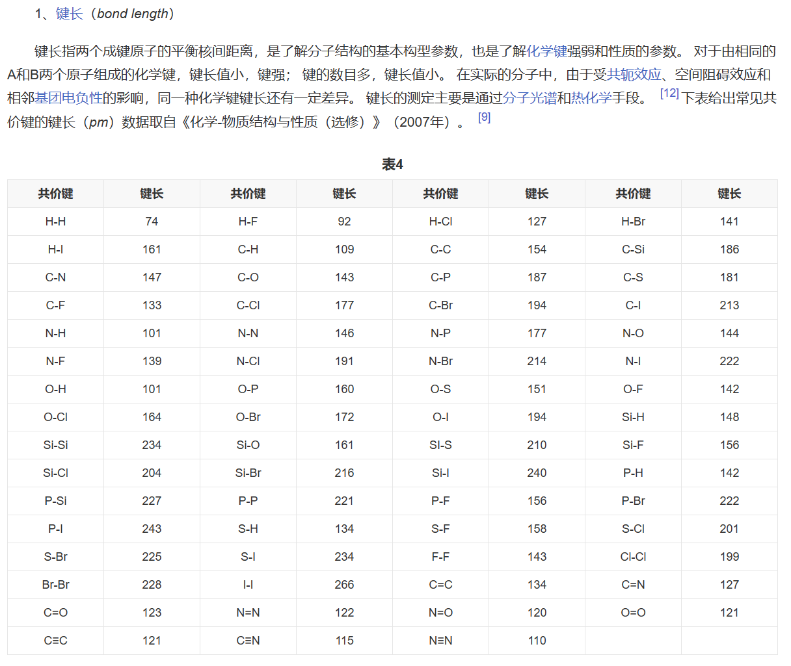

[共价键](https://zhidao.baidu.com/search?word=共价键&fr=iknow_pc_qb_highlight)从不同的角度可以进行不同的分类，每一种分类都包括了所有的共价键（只是分类角度不同）。


**按成键方式**

[共价键_百度百科 (baidu.com)](https://baike.baidu.com/item/共价键/549226)

σ键

由两个[原子轨道](https://zhidao.baidu.com/search?word=原子轨道&fr=iknow_pc_qb_highlight)沿轨道[对称轴](https://zhidao.baidu.com/search?word=对称轴&fr=iknow_pc_qb_highlight)方向相互重叠导致电子在核间出现概率增大而形成的共价键，叫做σ键，可以简记为“头碰头”。σ键属于定域键，它可以是一般共价键，也可以是配位共价键。一般的单键都是σ键。原子轨道发生杂化后形成的共价键也是σ键。由于σ键是沿轨道对称轴方向形成的，轨道间重叠程度大，所以，通常σ键的键能比较大，不易断裂，而且，由于有效重叠只有一次，所以两个原子间至多只能形成一条σ键。

π键

成键原子的未杂化p轨道，通过平行、侧面重叠而形成的共价键，叫做π键，可简记为“肩并肩”。π键与σ键不同，它的成键轨道必须是未成对的p轨道。π键性质各异，有两中心，两电子的定域键，也可以是共轭Π键和反馈Π键。两个原子间可以形成最多2条π键，例如，[碳碳双键](https://zhidao.baidu.com/search?word=碳碳双键&fr=iknow_pc_qb_highlight)中，存在一条σ键，一条π键，而碳碳三键中，存在一条σ键，两条π键。

δ键

由两个d轨道四重交盖而形成的共价键称为δ键，可简记为“面对面”。δ键只有两个节面（[电子云](https://zhidao.baidu.com/search?word=电子云&fr=iknow_pc_qb_highlight)密度为零的平面）。从键轴看去，δ键的轨道对称性与d轨道的没有区别，而[希腊字母](https://zhidao.baidu.com/search?word=希腊字母&fr=iknow_pc_qb_highlight)δ也正来源于d轨道。


在VASP中，常常计算Bader电荷来得到原子周围的电子数，从而近似得到原子的化合价。Bader电荷分析是理查德·贝德（RichardBader）开发的一种将分子分解为原子的直观方法。Bader电荷分析对原子的定义纯粹是基于电子电荷密度。Bader使用所谓的零磁通表面来划分原子。零通量表面是2D表面，其上电荷密度垂直于表面。

通常在分子系统中，电荷密度在原子之间达到最小值，这是将原子彼此分开的自然位置。除了作为分子中原子可视化的直观方案外，Bader的定义通常也可用于电荷分析。例如，Bader体积内的电荷与原子的总电子电荷很接近。电荷分布可用于确定相互作用的原子或分子的多极矩。Bader的分析也被用来定义原子的硬度，可以用来量化从原子中去除电荷的成本。


考虑的分子有


## Bader Charge

>http://theory.cm.utexas.edu/henkelman/code/bader/
>
>http://theory.cm.utexas.edu/vtsttools/
>
>[VASP从入门到入土：Bader电荷的计算 - 知乎 (zhihu.com)](https://zhuanlan.zhihu.com/p/673557738)

### Introduction

[Richard Bader](http://www.chemistry.mcmaster.ca/bader/), from McMaster University, developed an intuitive way of dividing molecules into atoms. His definition of an atom is based purely on the electronic charge density. Bader uses what are called **zero flux surfaces** to divide atoms. A zero flux surface is a 2-D surface on which the charge density is a minimum perpendicular to the surface. Typically in molecular systems, the charge density reaches a minimum between atoms and this is a natural place to separate atoms from each other.

### Output files

The following output files are generated: `ACF.dat`, `BCF.dat`, `AtomVolumes.dat`.

- `ACF.dat` contains the coordinates of each atom, the charge associated with it according to Bader partitioning, percentage of the whole according to Bader partitioning and the minimum distance to the surface. This distance should be compared to maximum cut-off radius for the core region if pseudo potentials have been used.

- `BCF.dat` contains the coordinates of each Bader maxima, the charge within that volume, the nearest atom and the distance to that atom.

- `AtomVolumes.dat` contains the number of each volume that has been assigned to each atom. These numbers correspond to the number of the BvAtxxxx.dat files.

### Note for VASP users

One major issue with the charge density (CHGCAR) files from the VASP code is that they only contain the valance charge density. The Bader analysis assumes that charge density maxima are located at atomic centers (or at pseudoatoms). Aggressive pseudopotentials remove charge from atomic centers where it is both expensive to calculate and irrelevant for the important bonding properties of atoms.

1. VASP contains a module (aedens) which allows for the core charge to be written out from PAW calculations. By adding the LAECHG=.TRUE. to the INCAR file, the core charge is written to AECCAR0 and the valance charge to AECCAR2. 

```bash
# the INCAR file
Global Parameters
ISTART = 1 # read the WAVECAR file
ICHARG = 1 # Read the charge density from CHGCAR file

LAECHG =.TRUE. #the all-electron charge density will be reconstructed explicitly and written to files.
LCHARG = .TRUE. # determines whether the charge densities (files CHGCAR and CHG) are written.
NSW    = 0 # sets the maximum number of ionic steps
IBRION = -1 # The ions are not moved, but NSW outer loops are performed.
```

2. These two charge density files can be summed using the [chgsum.pl](http://theory.cm.utexas.edu/vtsttools/scripts.html) script, and the total charge will be written to CHGCAR_sum.

```bash
chgsum.pl AECCAR0 AECCAR2
```

3. The bader analysis can then be done on this total charge density file:

```bash
bader CHGCAR -ref CHGCAR_sum

grep ZVAL POTCAR
```

4. One finally note is that you need a fine fft grid to accurately reproduce the correct total core charge. It is essential to do a few calculations, increasing NG(X,Y,Z)F until the total charge is correct.


